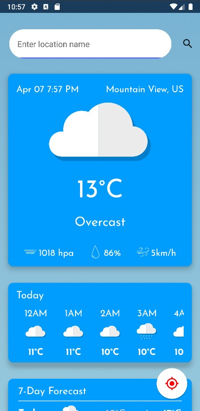
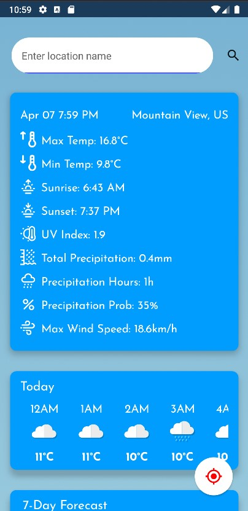
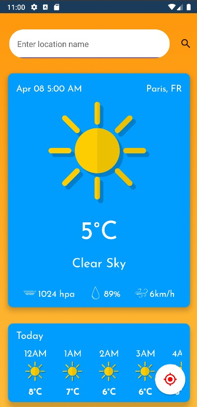
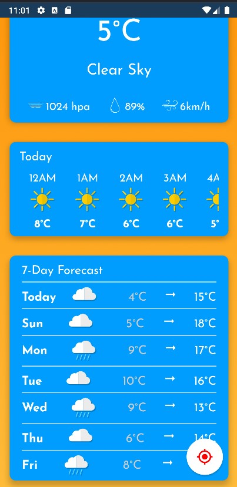

# WeatherApp
-----
This Android App is made with Kotlin using Android Jetpack Compose toolkit.

This app consumes weather data from [Open-Meteo](https://open-meteo.com/) API using Retrofit 2 
library and location data from Geocoder API.

It also utilizes Hilt Dependency Injection, Kotlin Coroutine, and MVI Architecture for building
a clean Android application.

• The Weather App features the display of Current Temperature (in Celsius), Weather Condition,
Date and Time, Location Name, Pressure, Relative Humidity, and Wind Speed on the main page card.

-----

• The user can click on the card to reveal more information with a flip animation. It details
Max and Min Temperature, Sunrise and Sunset, UV Index, Total Precipitation, Precipitation Hours,
Precipitation Probability, and Max Wind Speed.

-----

• The user can also search for specific location using the searchbar at the top of the main page. 
The search keyword can be vague like "Paris" to get result for Paris, France or specific like 
"Paris, Texas" for result for Paris, Texas, USA.

-----

• The user can scroll down for additional information, 24h-hourly weather forecast and 7-day weather 
forecast.

-----

There are more features like <mark>Current Location Button</mark> where user can press to see 
weather information for their current location and <mark>Dynamic Background</mark> where the 
background color changes depending the weather condition.

# Note
This is my first take on Android App Development. Plus, the app only works with API level 28 (Android Pie) or below.
This project is partially based on Philipp Lackner
Weather App Youtube tutorial. Link to his channel: [Philipp Lackner](https://www.youtube.com/@PhilippLackner)
